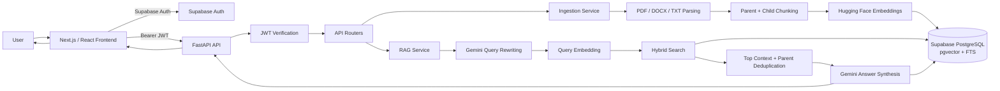
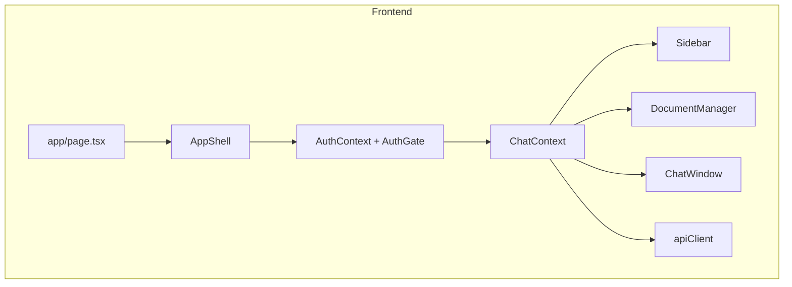
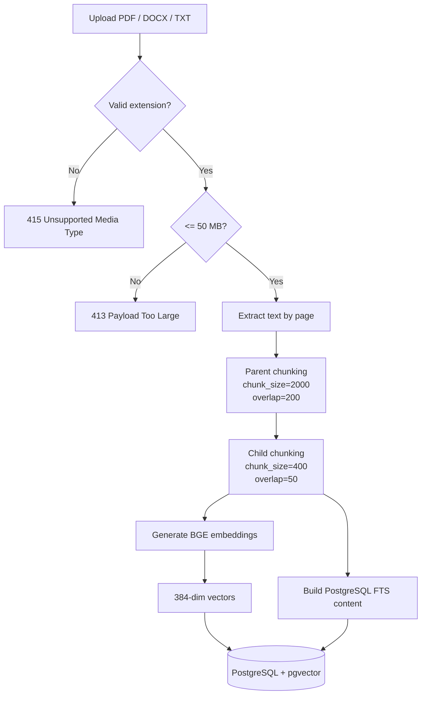
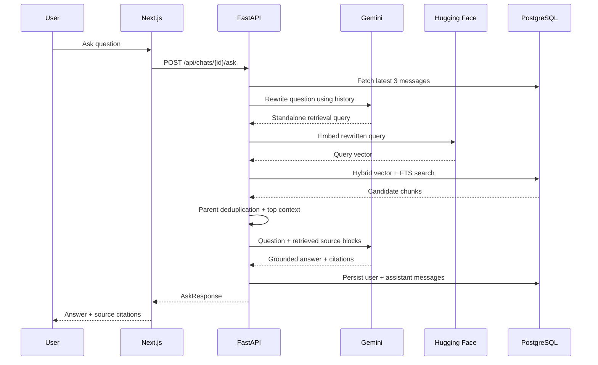
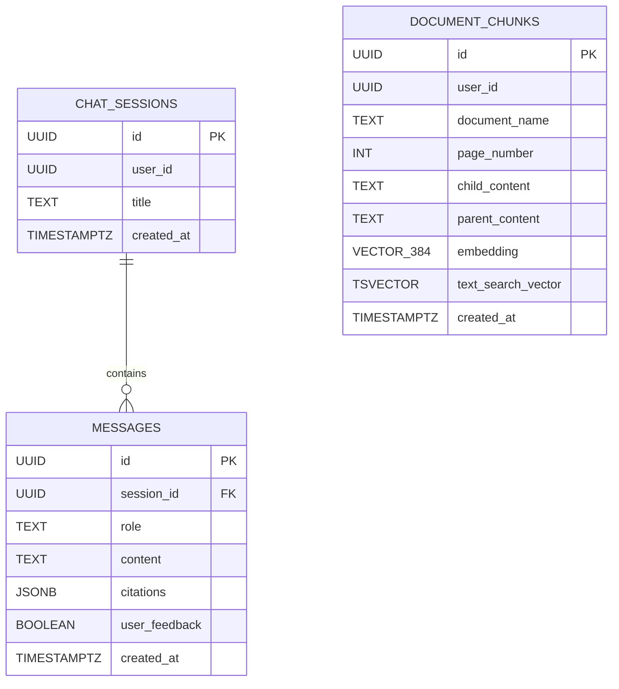
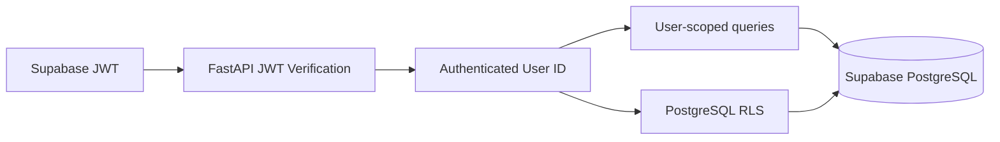
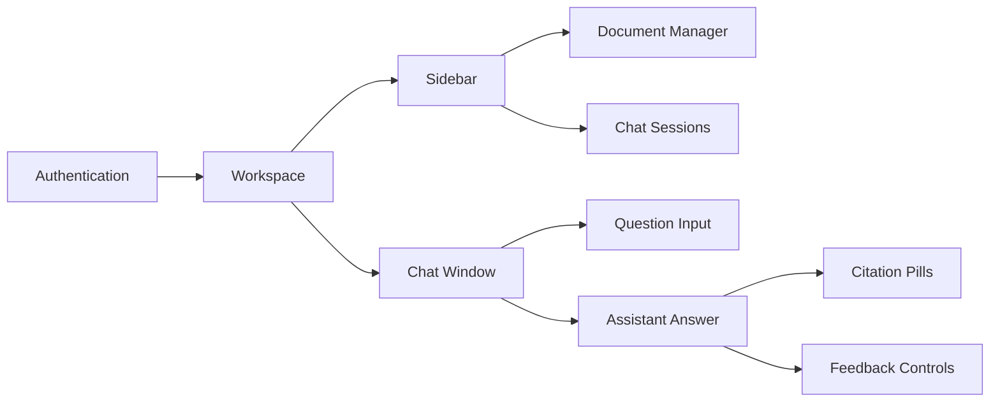

# RAGVault

> A full-stack, multi-user Document Q&A application built around Retrieval-Augmented Generation (RAG), hybrid retrieval, conversational query rewriting, source citations, and user feedback.

RAGVault lets users upload PDF, DOCX, and TXT documents, index their contents as vector and full-text searchable chunks, and ask questions against those documents through a conversational UI.

## ✨ Highlights

- 📄 **Document ingestion** for PDF, DOCX, and TXT files
- 🧩 **Hierarchical parent/child chunking** for better retrieval context
- 🧠 **BGE embeddings** through the Hugging Face Inference API
- 🔎 **Hybrid retrieval** combining pgvector cosine similarity with PostgreSQL full-text search
- 💬 **Conversational query rewriting** using the last 3 chat messages
- 🤖 **Gemini-powered answer synthesis** grounded only in retrieved source blocks
- 📚 **Source citations** with document name, page number, and retrieval score
- 👤 **Supabase authentication** with JWT verification in FastAPI
- 🔐 **Per-user data isolation** through user-scoped queries and PostgreSQL Row Level Security
- 👍👎 **Answer feedback** persisted with assistant messages
- ⚡ **Async FastAPI backend** with SQLAlchemy + asyncpg
- 🎨 **Next.js + React frontend** with a focused chat workspace and document manager

---

## 🏗️ Architecture



### Technology Stack

| Layer | Technology |
|---|---|
| Frontend | Next.js 16, React 19, TypeScript, Tailwind CSS |
| Backend | FastAPI, Python, SQLAlchemy Async |
| Database | PostgreSQL / Supabase |
| Vector Search | pgvector |
| Keyword Search | PostgreSQL `tsvector` / full-text search |
| Authentication | Supabase Auth + JWT |
| Embeddings | Hugging Face `BAAI/bge-small-en-v1.5` |
| LLM | Google Gemini (`gemini-2.5-flash` by default) |
| HTTP | Axios (frontend), HTTPX (backend) |

---

## 📁 Repository Structure

```text
RAGVault/
├── backend/
│   ├── app/
│   │   ├── core/
│   │   │   ├── config.py
│   │   │   ├── database.py
│   │   │   ├── middleware.py
│   │   │   └── security.py
│   │   ├── models/
│   │   │   ├── base.py
│   │   │   ├── schemas.py
│   │   │   └── tables.py
│   │   ├── routers/
│   │   │   ├── auth.py
│   │   │   ├── chats.py
│   │   │   ├── documents.py
│   │   │   └── messages.py
│   │   ├── services/
│   │   │   ├── embedding.py
│   │   │   ├── gemini.py
│   │   │   ├── ingestion.py
│   │   │   └── rag.py
│   │   └── main.py
│   ├── .env.example
│   ├── requirements.txt
│   └── supabase_schema.sql
│
├── frontend/
│   ├── src/
│   │   ├── app/
│   │   │   ├── globals.css
│   │   │   ├── layout.tsx
│   │   │   └── page.tsx
│   │   ├── components/
│   │   │   ├── AppShell.tsx
│   │   │   ├── AuthGate.tsx
│   │   │   ├── ChatWindow.tsx
│   │   │   ├── CitationPills.tsx
│   │   │   ├── ConfigScreen.tsx
│   │   │   ├── DocumentManager.tsx
│   │   │   ├── FeedbackControls.tsx
│   │   │   ├── LoadingScreen.tsx
│   │   │   └── Sidebar.tsx
│   │   ├── context/
│   │   │   ├── AuthContext.tsx
│   │   │   └── ChatContext.tsx
│   │   ├── hooks/
│   │   │   ├── apiClient.ts
│   │   │   └── useAsyncAction.ts
│   │   ├── lib/
│   │   │   ├── config.ts
│   │   │   └── supabase.ts
│   │   ├── types/
│   │   │   └── api.ts
│   │   └── utils/
│   │       └── classNames.ts
│   ├── .env.example
│   ├── next.config.mjs
│   ├── package.json
│   ├── postcss.config.js
│   ├── tailwind.config.js
│   └── tsconfig.json
│
└── .gitignore
```

### Component responsibilities



---

# 🚀 Getting Started

## 1. Prerequisites

Make sure you have:

- Python 3.10+ recommended
- Node.js 20+ recommended
- npm
- A Supabase project
- A Hugging Face API token
- A Gemini API key

---

## 2. Configure Supabase

Create a Supabase project and run:

```bash
backend/supabase_schema.sql
```

in the Supabase SQL editor.

The schema creates:

- `document_chunks`
- `chat_sessions`
- `messages`
- pgvector and full-text-search indexes
- Row Level Security policies tied to `auth.uid()`

The document embeddings use a **384-dimensional** vector column.

---

## 3. Backend Setup

```bash
cd backend

python -m venv .venv
```

### Windows

```bash
.venv\Scripts\activate
```

### macOS / Linux

```bash
source .venv/bin/activate
```

Install dependencies:

```bash
pip install -r requirements.txt
```

Create your environment file:

```bash
copy .env.example .env
```

or on macOS/Linux:

```bash
cp .env.example .env
```

Set the required values in `.env`:

```env
DATABASE_URL="postgresql+asyncpg://..."
SUPABASE_URL="https://<project-ref>.supabase.co"
SUPABASE_JWT_AUDIENCE="authenticated"

HUGGINGFACE_API_TOKEN="..."
HUGGINGFACE_EMBEDDING_MODEL="BAAI/bge-small-en-v1.5"

GEMINI_API_KEY="..."
GEMINI_MODEL="gemini-2.5-flash"

CORS_ORIGINS="http://localhost:3000,http://127.0.0.1:3000"
```

Start the API:

```bash
uvicorn app.main:app --reload --port 8000
```

Health check:

```text
GET http://localhost:8000/health
```

Expected response:

```json
{
  "status": "ok"
}
```

---

## 4. Frontend Setup

Open another terminal:

```bash
cd frontend
npm install
```

Create the environment file:

```bash
copy .env.example .env.local
```

or:

```bash
cp .env.example .env.local
```

Configure:

```env
NEXT_PUBLIC_SUPABASE_URL=https://<project-ref>.supabase.co
NEXT_PUBLIC_SUPABASE_ANON_KEY=<supabase-anon-key>
NEXT_PUBLIC_API_BASE_URL=http://localhost:8000/api
```

Start the development server:

```bash
npm run dev
```

Open:

```text
http://localhost:3000
```

---

# 🔄 How Document Ingestion Works

RAGVault processes an uploaded file through a multi-stage indexing pipeline.



### Supported file formats

| Format | Supported |
|---|---:|
| PDF | ✅ |
| DOCX | ✅ |
| TXT | ✅ |
| Markdown | ❌ |
| CSV | ❌ |
| Images | ❌ |

The current frontend and backend both enforce the PDF/DOCX/TXT set.

---

# 🧠 How RAG Querying Works

A user question is processed in multiple stages before the final answer is generated.



---

## 🔎 Hybrid Retrieval

The retrieval query combines two signals:

1. **Semantic similarity** using pgvector cosine similarity
2. **Keyword relevance** using PostgreSQL full-text search

The current scoring formula is:

```text
hybrid_score =
    0.72 × vector_score
  + 0.28 × text_score
```

The system retrieves up to:

```text
20 candidate chunks
```

and then keeps up to:

```text
5 context blocks
```

while removing duplicate parent blocks.

### Why hybrid retrieval?

Semantic search is useful for paraphrased questions, while full-text search is useful for exact terminology, names, identifiers, and keywords. Combining them provides a more robust retrieval signal than either method alone.

---

# 💬 Conversational Query Rewriting

Before retrieval, the backend loads the **last 3 messages** from the active session and asks Gemini to convert the latest user message into a standalone search query.

Example:

```text
Conversation:
User: Tell me about the authentication flow.
Assistant: The application uses JWT-based authentication.
User: Where is it validated?

Rewritten retrieval query:
"Where and how are Supabase JWT access tokens validated by the backend authentication layer?"
```

This improves retrieval for follow-up questions that depend on conversational context.

If Gemini query rewriting fails or is rate limited, the original user question is used as the retrieval query.

---

# 🤖 Grounded Answer Generation

The answer-generation prompt explicitly instructs Gemini to:

- answer only from retrieved source blocks
- avoid outside knowledge
- state when the documents do not contain enough information
- cite factual claims using `[Source N]`

The source metadata returned to the frontend contains:

```json
{
  "source": 1,
  "document_name": "example.pdf",
  "page_number": 4,
  "score": 0.8123
}
```

This is rendered as citation pills in the chat UI.

---

# 🗄️ Data Model



`document_chunks` and `chat_sessions` are scoped by `user_id`, while `messages` inherit user ownership through their chat session.

---

# 🔐 Authentication & Data Isolation

The frontend authenticates users with Supabase.

Each API request automatically attaches:

```http
Authorization: Bearer <supabase-access-token>
```

The backend then:

1. extracts the bearer token
2. verifies the Supabase JWT
3. validates the token audience / issuer
4. resolves the user UUID from the `sub` claim
5. scopes database operations to that user

The database schema also enables Row Level Security:

```text
auth.uid() = user_id
```

This gives the project two layers of user isolation:



---

# 📡 API Overview

All application endpoints are mounted under `/api`.

| Method | Endpoint | Purpose |
|---|---|---|
| GET | `/api/auth/me` | Return the authenticated user |
| POST | `/api/documents` | Upload and index a document |
| GET | `/api/documents` | List the user's documents |
| DELETE | `/api/documents/{document_name}` | Delete a document |
| GET | `/api/chats` | List chat sessions |
| POST | `/api/chats` | Create a chat session |
| GET | `/api/chats/{session_id}/messages` | Fetch chat messages |
| POST | `/api/chats/{session_id}/ask` | Ask a RAG question |
| DELETE | `/api/chats/{session_id}` | Delete a chat session |
| PATCH | `/api/messages/{message_id}/feedback` | Rate an assistant answer |
| GET | `/health` | Health check |

---

# 🎨 Frontend Experience

The application is structured around a simple workspace:



The frontend currently includes:

- authentication gate
- Supabase configuration screen
- document upload and deletion
- upload progress
- chat session management
- message history
- question input
- citation display
- thumbs-up / thumbs-down feedback
- responsive sidebar

---

# ⚙️ Configuration

### Backend

Key backend environment variables:

```env
DATABASE_URL
SUPABASE_URL
SUPABASE_JWT_AUDIENCE
SUPABASE_JWT_SECRET
CORS_ORIGINS

HUGGINGFACE_API_TOKEN
HUGGINGFACE_EMBEDDING_MODEL
HUGGINGFACE_TIMEOUT_SECONDS
HUGGINGFACE_BATCH_SIZE

GEMINI_API_KEY
GEMINI_MODEL
GEMINI_TIMEOUT_SECONDS

MAX_UPLOAD_MB
RAG_CANDIDATE_LIMIT
RAG_CONTEXT_LIMIT
```

Defaults currently include:

```text
Embedding model: BAAI/bge-small-en-v1.5
Gemini model:    gemini-2.5-flash
Max upload:      50 MB
Candidates:      20
Final context:   5
HF batch size:   8
```

### Frontend

```env
NEXT_PUBLIC_SUPABASE_URL
NEXT_PUBLIC_SUPABASE_ANON_KEY
NEXT_PUBLIC_API_BASE_URL
```

---

# 🧪 Useful Development Commands

### Backend

```bash
uvicorn app.main:app --reload --port 8000
```

### Frontend

```bash
npm run dev
npm run build
npm run start
npm run typecheck
```

---

# 📌 Design Notes

### Parent/child chunking

Instead of retrieving only tiny fragments, the system stores:

```text
Parent chunk
└── Child chunk
    └── Embedding used for retrieval
```

Search is performed over child embeddings, while the larger parent block is supplied to Gemini as context. This preserves retrieval precision without sacrificing answer context.

### Persistent chat memory

Every question/answer is stored in the `messages` table, allowing the application to:

- restore previous conversations
- use recent messages for query rewriting
- associate citations with assistant responses
- store user feedback

### Feedback loop

Assistant messages contain:

```text
user_feedback = NULL | TRUE | FALSE
```

which provides a lightweight foundation for evaluating answer quality later.

---

# 🛠️ Potential Next Improvements

The current architecture is a strong base, and the following would be natural extensions:

- streaming Gemini responses
- background/asynchronous document ingestion for very large files
- OCR support for scanned PDFs
- Markdown / HTML / CSV loaders
- reranking with a cross-encoder
- configurable hybrid-search weights
- document-level filtering during retrieval
- richer analytics from stored feedback
- evaluation with RAGAS or a custom benchmark
- citation-aware answer highlighting
- document versioning and duplicate detection

---

## 🙌 Acknowledgements

Built with:

- [FastAPI](https://fastapi.tiangolo.com/)
- [Next.js](https://nextjs.org/)
- [Supabase](https://supabase.com/)
- [PostgreSQL](https://www.postgresql.org/)
- [pgvector](https://github.com/pgvector/pgvector)
- [Hugging Face](https://huggingface.co/)
- [Google Gemini](https://ai.google.dev/)

---

## 📎 Repository

**RAGVault:**  
https://github.com/Amanjainji/RAGVault
